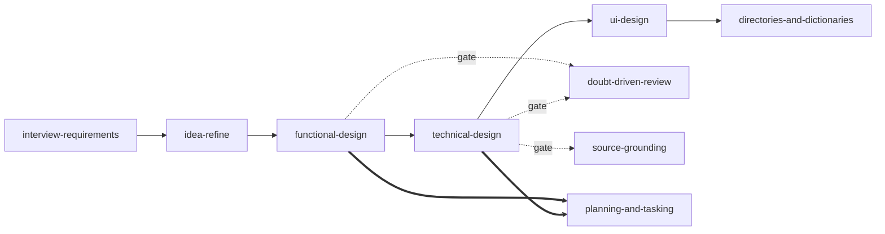

# Design and Build Skills

A **convention-driven** agent-skill set for the full software lifecycle — **Define → Plan → Build → Ship**. The Define→Plan skills author a project's design docs; the Build→Ship skills implement them, treating the design docs as the spec source so the traceability graph survives into the code.

The project's **`Conventions/`** are the single source of truth, and every skill *references* them rather than copying them.

## Install

Cross-agent `SKILL.md` standard — installs on **Claude Code** (`~/.claude/skills/`) and **OpenAI Codex** (`~/.codex/skills/`) from the same `skills/` tree. See [`INSTALL.md`](INSTALL.md); quick start: `./install.ps1 -Platform claude -Scope personal` (or `./install.sh codex personal`). Drop-in repo rules files are in [`templates/`](templates/).

## Starting a new project

The `project-init` skill scaffolds a fresh project's documentation structure at a target directory from bundled, parameterized templates (inside `skills/project-init/project-template/` so they travel on install):

- `Conventions/` — the 7 convention guides, parameterized with `{{tokens}}`. **Deployed with token substitution.**
- `_templates/` — tokenized `README` + `tasks.md` and the `Platform/` + `Applications/_app-template/` skeleton stubs. **Deployed with substitution.**

## The skills — Define → Plan

| Skill | Phase | What it does |
|---|---|---|
| `using-design-skills` | meta | Router + operating principles. Start here. |
| `project-init` | setup | Scaffold a new project's doc structure at a target dir from bundled templates. |
| `interview-requirements` | Define | Drive to confidence before writing FRs. |
| `idea-refine` | Define | Shape a rough concept into a concrete *unit* proposal. |
| `functional-design` | Define | Author a unit's Functional doc (the *what*). |
| `technical-design` | Define | Author a unit's Technical Design (the *how*) — NFRs + components. |
| `ui-design` | Define | Review the UI page-by-page and surface the entities it entails; generate mockups. |
| `directories-and-dictionaries` | Define | Formalize the surfaced entities into the Dictionaries + Directories (SSOT catalogs). |
| `planning-and-tasking` | Plan | Decompose into `task-NNNNN` entries. **Centerpiece.** |
| `doubt-driven-review` | gate | Adversarial CLAIM→EXTRACT→DOUBT→RECONCILE pass on decisions. |
| `source-grounding` | gate | Ground tech choices in official docs. |

`doubt-driven-review` and `source-grounding` are **gates** — called from inside the design skills, not (usually) on their own.

## The skills — Build → Ship

Implement a planned `task-NNNNN` against the design docs. The stack + doc→code mapping live in [`references/implementation-stack-and-doc-mapping.md`](references/implementation-stack-and-doc-mapping.md) — these skills are **stack-agnostic**; record your stack there once and they inherit it.

| Skill | Phase | What it does |
|---|---|---|
| `incremental-implementation` | Build | Build a task in thin vertical slices, each tested + committed. |
| `test-driven-development` | Build | Red→Green→Refactor; tests encode FR/acceptance. |
| `context-engineering` | Build | Keep the working set small via the docs; rules files. The token skill. |
| `frontend-ui-engineering` | Build | Implement a web client / portal page from its UI requirements. |
| `api-and-interface-design` | Build | Implement an interface to match its Directory entry exactly. |
| `browser-testing-with-devtools` | Verify | Verify a portal page's documented states at runtime. |
| `debugging-and-error-recovery` | Verify | Reproduce→localize→reduce→fix→guard→classify, using the logs. |
| `environment-discipline` | Verify | Durable ENVIRONMENT.md gotcha ledger; workspace hygiene; promote recurring gotchas into fixes. |
| `code-review-and-quality` | Review | Five-axis review; verify code matches the contract it claims. |
| `code-simplification` | Review | Reduce complexity; Chesterton's Fence; no behavior change. |
| `security-and-hardening` | Review | RBAC, secret store, boundary defenses per the docs. |
| `performance-optimization` | Review | Measure-first; web vitals, database queries, queue throughput. |
| `git-workflow-and-versioning` | Ship | Atomic commits citing `task-NNNNN`; interface versioning. |
| `ci-cd-and-automation` | Ship | Shift-left quality gates incl. Directory-contract checks. |
| `deprecation-and-migration` | Ship | Deprecate-don't-delete; migrations via the runner. |
| `observability-and-instrumentation` | Ship | Log Dictionary sources, RED metrics, tracing. |
| `shipping-and-launch` | Ship | Pre-launch checklist, staged rollout, rollback, close the loop. |

## Lifecycle

`planning-and-tasking` runs **alongside** the design skills: as each design doc firms up, work to build it is decomposed into the relevant `tasks.md`.

## Design principles (why this set looks like this)

- **Artifacts + process.** The design docs are the durable record (task schema, traceability graph, Dictionaries/Directories, SSOT); the skills add the *process* — interview-to-confidence, idea shaping, decomposition discipline, adversarial doubt, source grounding.
- **Design docs are the spec source for code.** The Build→Ship skills don't reinvent contracts — they implement the Directories/Dictionaries/FRs/NFRs/UI requirements, and keep the traceability graph alive in tests, commits, and PRs ([`references/implementation-stack-and-doc-mapping.md`](references/implementation-stack-and-doc-mapping.md)).
- **Reference, don't duplicate.** Skills point at the Conventions; the `references/` folder holds only thin pointers + entry-schema cheatsheets so a skill is loadable standalone.

## `references/`

Shared, DRY checklists every authoring skill cites:

- [`frontmatter-schema.md`](references/frontmatter-schema.md) — the output frontmatter contract.
- [`markdown-and-diagram-discipline.md`](references/markdown-and-diagram-discipline.md) — the Obsidian+GitHub pre-save checklist.
- [`stable-id-and-cross-link-graph.md`](references/stable-id-and-cross-link-graph.md) — IDs (FR/NFR/CMP/…) + the traceability graph.
- [`doc-anatomy-cheatsheets.md`](references/doc-anatomy-cheatsheets.md) — FR / NFR / component / interface / UI / task entry schemas.
- [`implementation-stack-and-doc-mapping.md`](references/implementation-stack-and-doc-mapping.md) — the stack (fill in your own) + how each design-doc artifact maps to code.

## Stack

The Build→Ship skills are **stack-agnostic**. Record your project's stack once in [`references/implementation-stack-and-doc-mapping.md`](references/implementation-stack-and-doc-mapping.md) (backend, database, event bus, API + MCP surface, web client, optional desktop client, secret store) and the skills inherit it.
